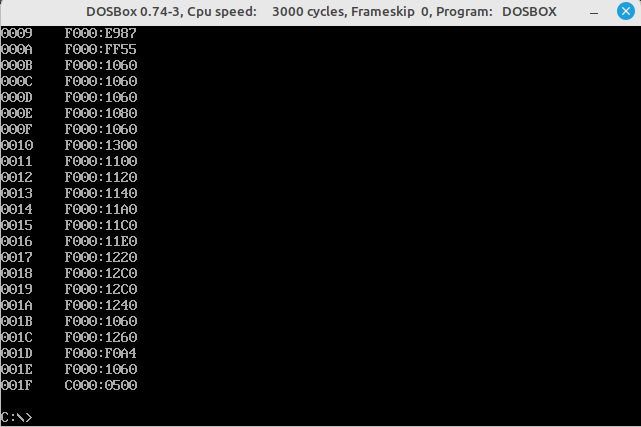
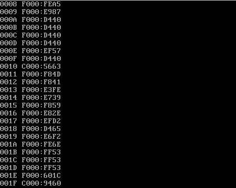

# Помощник для отладки BIOS

- intdump.asm - Программа для сохранения обработчика прерывания с параметрами командной строки.
```
Usage: INTDUMP <interrupt_number> [filename]
```

На вход принимает номер вектора прерывания, на экран выводит адресс расположения вектора и сохраняет первые 64кБ данных.

- intvect.asm - программа выводит на экран адреса векторов прерываний от 0 до 0x1F. 

- memdump.asm - программа сохраняет дамп BIOS в файл MEMDUMP.BIN.

Все программы собираются компилятором nasm. Например:

```sh
nasm intvect.asm -fbin -o intvect.com
```

Получаются COM-файлы, которые можно запустить в любом DOS. Скрин ниже из dosbox.




- mbr_int.asm - программа аналогичная intvect, однако позволяет увидеть не подменённые вектора DOS. Загружается в бут сектор дискеты. Для этого после сборки выполнить:

```sh
nasm mbr_int.asm -f bin -o mbr_int.bin
sudo dd if=mbr_int.bin of=/dev/sdh
```

Скрин ниже из qemu. Проверялось командой:

```sh
qemu-system-i386 mbr_int.bin
```


